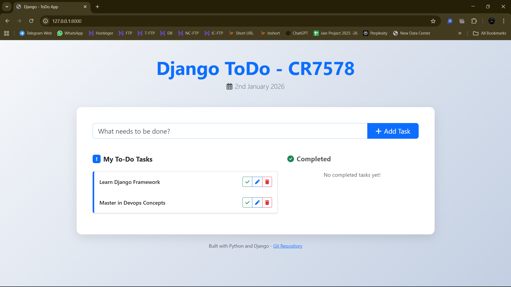

# 📝 Django ToDo Application

<div align="center">
  
  
  
  
  
  
  
  **A modern, elegant, and fully functional ToDo application built with Django**
  
  [Features](#-features) • [Demo](#-demo) • [Installation](#-installation) • [Usage](#-usage) • [Project Structure](#-project-structure) • [Contributing](#-contributing)

</div>

---

## 🌟 Features

| Feature | Description |
|---------|-------------|
| ✅ **Add Tasks** | Quickly add new tasks with a simple, intuitive interface |
| ✏️ **Edit Tasks** | Modify existing tasks inline without page reload |
| 🗑️ **Delete Tasks** | Remove tasks with a single click |
| ✔️ **Mark Complete** | Toggle tasks between completed and incomplete status |
| 📅 **Date Tracking** | Automatic timestamps for task creation and updates |
| 📱 **Responsive Design** | Beautiful UI that works on all devices |
| 🎨 **Modern UI** | Gradient backgrounds, smooth animations, and Bootstrap 5 styling |
| 🛠️ **Admin Panel** | Django admin interface for advanced task management |

---

## 🎬 Demo

### 📹 Video Walkthrough

https://github.com/user-attachments/assets/Django-Todo-Output.mp4

> *Watch the full demo showing all features in action*

### 📸 Screenshots

<details>
<summary><strong>🖼️ Click to view screenshots</strong></summary>

#### Adding a New Task

*Clean and intuitive interface for adding new tasks*

#### Editing a Task

*Inline editing capability with smooth transitions*

#### Task Completed

*Visual distinction between active and completed tasks*

</details>

---

## 📋 Prerequisites

Before you begin, ensure you have the following installed on your system:

| Requirement | Version | Installation Guide |
|-------------|---------|-------------------|
| **Python** | 3.12+ | [Download Python](https://www.python.org/downloads/) |
| **pip** | Latest | Comes with Python |
| **Git** | Latest | [Download Git](https://git-scm.com/downloads/) |
| **Virtual Environment** | - | `pip install virtualenv` (optional) |

### 🔍 Verify Installation

```bash
# Check Python version
python --version

# Check pip version
pip --version

# Check Git version
git --version
```

---

## 🚀 Installation

Follow these steps to get the project running on your local machine:

### Step 1: Clone the Repository

```bash
git clone https://github.com/CR7578/Django-ToDo.git
cd Django-ToDo
```

### Step 2: Create Virtual Environment

**Windows:**
```bash
# Create virtual environment
python -m venv venv

# Activate virtual environment
venv\Scripts\activate
```

**macOS/Linux:**
```bash
# Create virtual environment
python3 -m venv venv

# Activate virtual environment
source venv/bin/activate
```

### Step 3: Install Dependencies

```bash
pip install -r requirements.txt
```

### Step 4: Apply Database Migrations

```bash
# Create database tables
python manage.py migrate
```

### Step 5: Create Superuser (Optional - for Admin Access)

```bash
python manage.py createsuperuser
```

Follow the prompts to create an admin account.

### Step 6: Run the Development Server

```bash
python manage.py runserver
```

### Step 7: Access the Application

Open your browser and navigate to:

| URL | Description |
|-----|-------------|
| `http://127.0.0.1:8000/` | Main ToDo Application |
| `http://127.0.0.1:8000/admin/` | Django Admin Panel |

---

## 📖 Usage

### ➕ Adding a Task
1. Type your task in the input field
2. Click the **"Add Task"** button or press Enter
3. Your task will appear in the **"My To-Do Tasks"** section

### ✏️ Editing a Task
1. Click the **pen/edit icon** (✏️) next to the task
2. Modify the task text in the inline input field
3. Click **"Update"** to save changes

### ✅ Completing a Task
1. Click the **checkmark icon** (✔️) next to the task
2. The task will move to the **"Completed"** section
3. Completed tasks appear with a strikethrough effect

### ↩️ Undo Completion
1. Click the **X icon** next to a completed task
2. The task will return to the **"My To-Do Tasks"** section

### 🗑️ Deleting a Task
1. Click the **trash icon** (🗑️) next to any task
2. The task will be permanently removed

---

## 📁 Project Structure

```
Django-ToDo/
│
├── 📂 assets/                    # Screenshots and demo videos
│   ├── Add.png                   # Add task screenshot
│   ├── Done.png                  # Completed task screenshot
│   ├── Edit.png                  # Edit task screenshot
│   └── Django-Todo-Output.mp4    # Demo video
│
├── 📂 templates/                 # HTML templates
│   └── home.html                 # Main application template
│
├── 📂 todo/                      # Main ToDo application
│   ├── __init__.py
│   ├── admin.py                  # Admin panel configuration
│   ├── apps.py                   # App configuration
│   ├── migrations/               # Database migrations
│   ├── models.py                 # Task model definition
│   ├── urls.py                   # App URL routes
│   └── views.py                  # View functions (CRUD operations)
│
├── 📂 todo_main/                 # Django project configuration
│   ├── __init__.py
│   ├── asgi.py                   # ASGI configuration
│   ├── settings.py               # Project settings
│   ├── urls.py                   # Main URL configuration
│   ├── views.py                  # Home view
│   └── wsgi.py                   # WSGI configuration
│
├── 📂 venv/                      # Virtual environment (gitignored)
│
├── .gitignore                    # Git ignore rules
├── db.sqlite3                    # SQLite database (gitignored)
├── manage.py                     # Django management script
├── README.md                     # This file
└── requirements.txt              # Python dependencies
```

---

## 🛠️ Technology Stack

<div align="center">

| Technology | Purpose |
|------------|---------|
|  | Backend Framework |
|  | Programming Language |
|  | Database |
|  | CSS Framework |
|  | Icons |
|  | Markup |
|  | Styling |
|  | Interactivity |

</div>

---

## 🗃️ Database Model

The application uses a simple `Task` model with the following fields:

```python
class Task(models.Model):
    task = models.CharField(max_length=250)          # Task description
    is_completed = models.BooleanField(default=False) # Completion status
    created_at = models.DateTimeField(auto_now_add=True)  # Creation timestamp
    updated_at = models.DateTimeField(auto_now=True)      # Last update timestamp
```

---

## 🔗 API Endpoints

| Method | Endpoint | Description |
|--------|----------|-------------|
| `GET` | `/` | Home page with task lists |
| `POST` | `/todo/addTask/` | Add a new task |
| `POST` | `/todo/editTask/<pk>` | Edit an existing task |
| `GET` | `/todo/delete/<pk>` | Delete a task |
| `GET` | `/todo/taskDone/<pk>/` | Mark task as completed |
| `GET` | `/todo/taskNotdone/<pk>/` | Mark task as incomplete |
| `GET` | `/admin/` | Django Admin Panel |

---

## 🤝 Contributing

Contributions are welcome! Here's how you can help:

1. **Fork** the repository
2. **Create** your feature branch (`git checkout -b feature/AmazingFeature`)
3. **Commit** your changes (`git commit -m 'Add some AmazingFeature'`)
4. **Push** to the branch (`git push origin feature/AmazingFeature`)
5. **Open** a Pull Request

---

## 📝 License

This project is open source and available under the [MIT License](LICENSE).

---

## 👨‍💻 Author

<div align="center">

**CR7578**

[](https://github.com/CR7578)

</div>

---

## ⭐ Show Your Support

If you found this project helpful, please consider giving it a ⭐ on GitHub!

---

<div align="center">
  
  Made with ❤️ using Django
  
</div>
